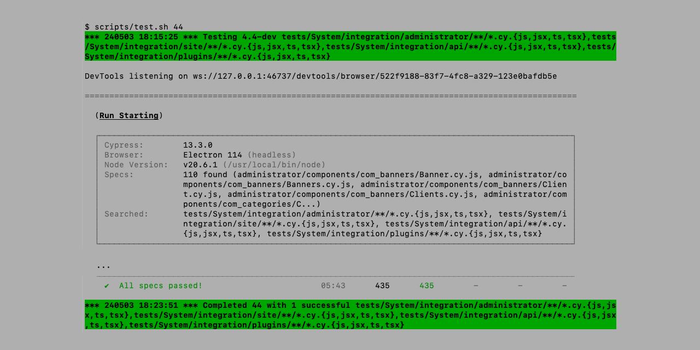

# Docker based Joomla System Tests

Running automated [Joomla System Tests](https://github.com/joomla/joomla-cms/tree/4.4-dev/tests/System) with [Cypress](https://www.cypress.io/) in a [Docker](https://www.docker.com/) container environment in all four development branches.



The idea is to have all active Joomla development branches (currently 4.4-dev, 5.1-dev, 5.2-dev and 6.0-dev)
available in parallel for Joomla System Tests. The test specifications are mostly branch-independent
and you can quickly test a new test specification or an error on all four branches.
As a prerequisite, it is sufficient to be able to run git, Docker and a bash script.
The installation takes place in seven Docker containers and is automated with scripts.
The result is a pure Docker container installation without manual installations or configurations.

To make life easier, the standard Docker Joomla images (`joomla:4` or `joomla:5`) are used as a starting point and
then overwritten with the source code from the respective Joomla development branch.
The Joomla installation itself is executed by the Cypress spec `Installation.cy.js` from the Joomla System Tests.

## Installation

### Prerequisites

[Git](https://git-scm.com/), [Docker](https://www.docker.com/) an a bash scripting environment are required and must be installed. The following `/etc/hosts` entry must exist:
```
127.0.0.1 host.docker.internal
```

The installation takes about 2 GB disk space.

Last tested with macOS 14 Sonoma, Windows 11 Pro WSL 2 and Ubuntu 24 Noble Numbat. For Ubuntu there is a script
[ubuntu_setup.sh](scripts/ubuntu_setup.sh) to install Docker, open firewall port, set `host.docker.internal` etc.:
```
sudo scripts/ubuntu_setup.sh
```

You can create the Docker containers and install Joomla with script [create.sh](scripts/create.sh) as a user, it is not necessary to be `root`:

```
git clone https://github.com/muhme/joomla-system-tests
cd joomla-system-tests
scripts/create.sh
```

:point_right: The scripts use [ANSI escape codes](https://en.wikipedia.org/wiki/ANSI_escape_code#Colors)
to color their own log and error messages.
This can be disabled by setting environment variable [NOCOLOR=1](https://no-color.org/).

## Containers

The abbreviation `jst` stands for Joomla System Tests:

|Name|Port|Directory :eight_spoked_asterisk: |Comment|
|----|----|----------------------------------|-------|
|jst_mysql| | | version 8.1 |
|jst_cypress| SMTP host.docker.internal:7025 | | SMTP server is only running during test execution |
|jst_mysqladmin|[7001](http://localhost:7001)| | user root / password root |
|jst_44|[7044](http://localhost:7044)| /branch_44 | Joomla branch 4.4-dev<br />PHP 8.1 |
|jst_51|[7044](http://localhost:7044)| /branch_50 | Joomla branch 5.1-dev<br />PHP 8.2 |
|jst_52|[7044](http://localhost:7044)| /branch_51 | Joomla branch 5.2-dev<br />PHP 8.2 |
|jst_60|[7044](http://localhost:7044)| /branch_52 | Joomla branch 6.0-dev<br />PHP 8.2 |

:eight_spoked_asterisk: The directories are available on Docker host e.g. to inspect and change the configuration
files (`configuration.php` or `cypress.config.js`) or the test specifications below `tests/System`.
And also one directory in each Joomla container and all together in `jst_cypress` container.

# Usage

:point_right: On Ubuntu with default enabled Uncomplicated Firewall (UFW) you need to allow SMTP port:
```
ufw allow 7025
```

Test all (more than 100 – as defined in Cypress `specPattern`) specs in all four branches:
```
scripts/test.sh
```

Test all specs only in branch 5.1-dev:
```
scripts/test.sh 51
```

Test one spec with all four branches (of course, the spec must exist in all branches) :
```
scripts/test.sh tests/System/integration/administrator/components/com_privacy/Consent.cy.js
```

Test all site specs with branch 4.4-dev using a pattern:
```
scripts/test.sh 44 'tests/System/integration/site/**/*.cy.{js,jsx,ts,tsx}'
```

To show `console.log` messages from Electron browser by setting environment variable: 
```
export ELECTRON_ENABLE_LOGGING=1
scripts/test.sh 44 tests/System/integration/administrator/components/com_actionlogs/Actionlogs.cy.js
```

## Limitations

The different Joomla versions exist in parallel, but the test runs sequentially.

Only one PHP version (the one from the Joomla Docker image) and one database type (currently MySQL 8.1) is used.

The Docker based Joomla System Tests are only intended for the headless operation of Cypress, the Cypress GUI is not available.

The access to Joomla uses unattractively different URLs from the host and from the Docker containers. For example, for Joomla 4.4:
* http://localhost:7044 - from host
* [http://jst_44](http://jst_44) - from docker container

## License

MIT License, Copyright (c) 2024 Heiko Lübbe, see [LICENSE](LICENSE)

## Contact

Don't hesitate to ask if you have any questions or comments. If you encounter any problems or have suggestions for enhancements, please feel free to [open an issue](../../issues).
