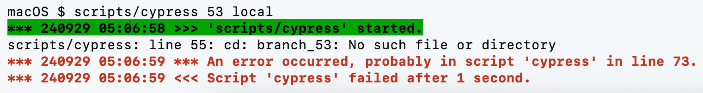
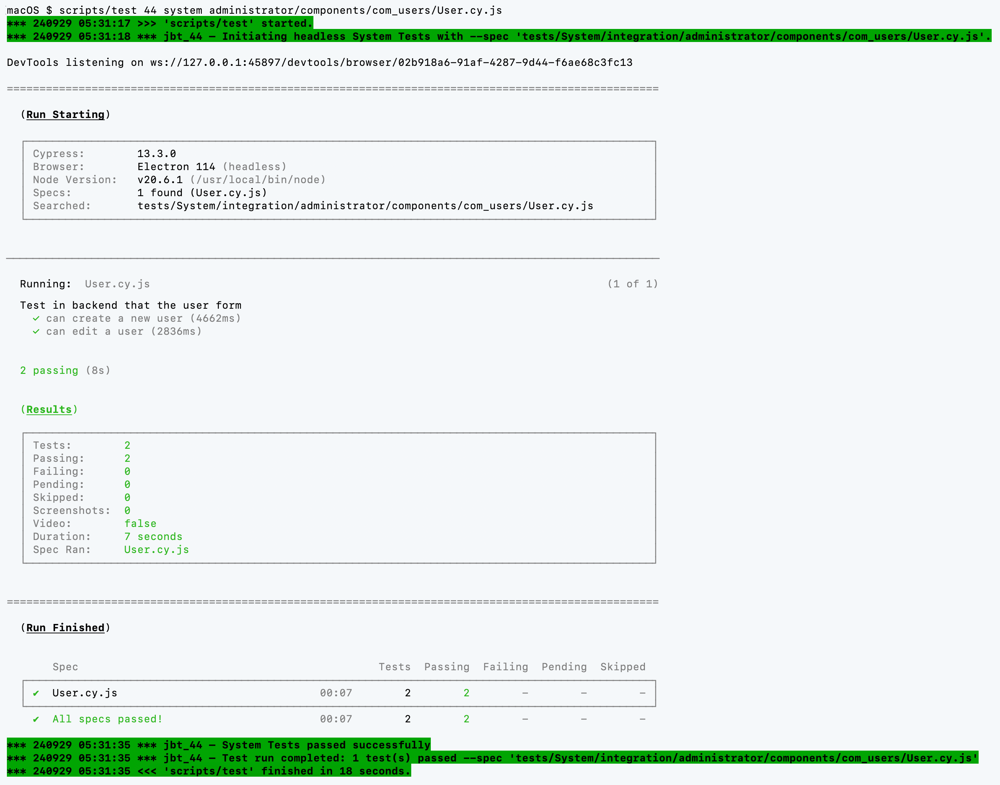

# JBT Scripts

These scripts implement the Joomla Branches Tester (JBT), delivering the complete functionality along with necessary configuration files. They are stored in this directory `scripts`.

You can run all scripts multiple times.
For a quick overview of all mandatory and optional arguments, run each script with the `help` argument. For example:

```
LANG=ja scripts/database help
```
```
*** 240909 16:00:10 >>> 'scripts/database' started.

    database – Change the database and database driver for all, one or multiple Joomla containers.
               The mandatory database variant must be one of: mysqli mysql mariadbi mariadb pgsql.
               Optional 'socket' for using the database with a Unix socket (default is using TCP host).
               Optional Joomla version can be one or more of the following: 44 51 52 53 60 (default is all).

               "惚れた病に薬なし。", 不明

*** 240909 16:00:11 <<< 'scripts/database' finished in 1 second.
```

:fairy: The random quote supports five languages, just like the
        [zitat-service.de](https://extensions.joomla.org/extension/news-display/quotes/zitat-service-de/)
        Joomla module. Set `LANG` to `de` for Deutsch, `en` for English, `es` for Español, `ja` for 日本語,
        or `uk` for Українська. The gnome can't stop playing with it.

## Your Scripts

The following scripts are available and the use is described in [../README.md](../README.md).

| Script | Description | Additional Info |
| --- | --- | --- |
| [scripts/check](check) | Searching a JBT log file for critical issues or selected information. | Optional argument(s): `logfile`, `jbt` and `scripts`. |
| [scripts/clean](clean.sh) | Delete all `jbt_*`-Docker containers and the `joomla-branches-tester_default` Docker network and `branch_*` folders. | Used by `scripts/create` or for you to get rid of all the stuff. |
| [scripts/create](create.sh) | (Re-)Build all docker containers. | Optional arguments are version number(s), database variant, `socket`, PHP version, `IPv6` and `no-cache`. |
| [scripts/cypress](cypress.sh) | Running interactive Cypress GUI. | Mandatory argument is the Joomla version number. Optional argument is `local` to use a locally installed Cypress. |
| [scripts/database](database.sh) | Changes database and database driver. | :warning: The overall database content is lost.<br />Mandatory argument is the database variant. Optional argument(s): `socket` and Joomla version number(s). |
| [scripts/graft](graft.sh) | Grafting a Joomla package onto a branch. | :warning: The overall database content is lost.<br />Mandatory argument is the Joomla package. Optional argument is the database variant.|
| [scripts/info](info) | Retrieves Joomla Branches Tester status information. |  |
| [scripts/patch](patch.sh) | Apply Git patches in 'joomla-cms', 'joomla-cypress' or 'joomla-framework/database'. | Arguments are one or multipe patches and optional version number(s). |
| [scripts/patchtester](patchtester.sh) | Installs and configures Joomla patch tester component in one or all Joomla instances. | The GitHub token comes from environment variable `JBT_GITHUB_TOKEN` or as mandatory argument. Optional argument(s): Joomla version number(s). |
| [scripts/php](php.sh) | Change used PHP version. | Mandatory is the PHP version, e.g. `php8.3`. Optional argument(s): Joomla version number(s). |
| [scripts/pull](pull.sh) | Running `git pull` and more. | Optional argument(s): Joomla version number(s). |
| [scripts/test](test.sh) | Running Cypress headless System Tests on one or all branches. | Optional argument(s): Joomla version number(s), browser and test spec pattern. |
| [scripts/ubuntu_setup.sh](ubuntu_setup.sh) | Helper script in an installation on Ubuntu Linux (native or in Windows WSL 2). | |
| [scripts/xdebug](xdebug.sh) | Switching PHP in web container to installation with or without Xdebug. | Mandatory argument is `on` or `off`. Optional arguments are the version number(s). |

The wrapper scripts (without the `.sh` extension) are used to duplicate log messages and
are not separately named in the list.

:point_right: The scripts use [ANSI escape codes](https://en.wikipedia.org/wiki/ANSI_escape_code#Colors)
to color their own log and error messages.
All messages start with three asterisks, the date and the time.
Starting a script is marked with `>>>` and ending a script with `<<<`.
Error messages are displayed in red and directed to the standard error output (stderr) stream:



Log messages are highlighted in green and directed to the standard output (stdout) stream.
See the following example:



Colouring can be avoided by setting the environment variable [NO_COLOR=1](https://no-color.org/).

## Engine Room Scripts and Configurations

The following scripts and configuration files are intended for internal usage only.

| File | Description | Additional Info |
| --- | --- | --- |
| [scripts/disableBC.cy.js](isableBC.cy.js) | Cypress script to disable 'Behaviour - Backward Compatibility' Joomla plugin. | Used by `scripts/database`. |
| [docker-compose.base.yml](docker-compose.base.yml) | The basic part of the `docker-compose.yml` file. | Used by `scripts/helper.sh`. |
| [docker-compose.end.yml](docker-compose.end.yml) | The last lines of the `docker-compose.yml` file. | Used by `scripts/helper.sh`. |
| [docker-compose.joomla.yml](docker-compose.joomla.yml) | Part of the `docker-compose.yml` file to be parameterised for one Joomla web server. | Used by `scripts/helper.sh`. |
| [dockerfile-relay.yml](dockerfile-relay.yml) | Docker container definition for the SMTP relay tripler. | Used to create `jbt_relay`. |
| [scripts/error-logging.ini](error-logging.ini) | Config file to catch all PHP errors, notices and warnings. | Used by `script/setup.sh`. |
| [scripts/helper.sh](helper.sh) | Some commonly used bash script functions and definitions. | Sourced and used by other Bash scripts within the project. |
| [scripts/patchtester.cy.js](patchtester.cy.js) | Cypress script to install and configure Joomla Patch Tester component. | Used by `scripts/patchtester`. |
| [scripts/pgpass](pgpass) | Auto-logon password file. | Used by `pgAdmin`. |
| [scripts/servers.json](servers.json) | PostgreSQL server configuration. | Used by `pgAdmin`. |
| [scripts/setup.sh](setup.sh) | Install and configure Docker web server containers. | Used by `scripts/create` and `scripts/php`. |
| [scripts/smtp_double_relay.py](smtp_double_relay.py) | SMTP relay triplicator source code. | Used by `jbt_relay`. |
